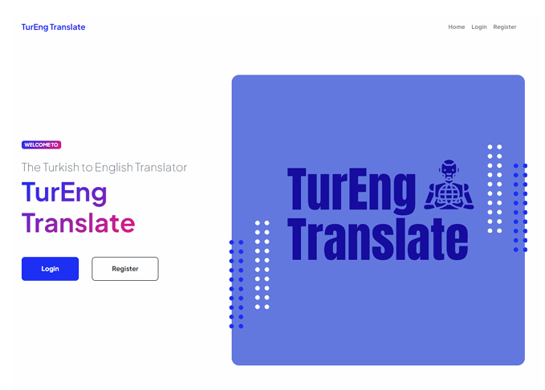
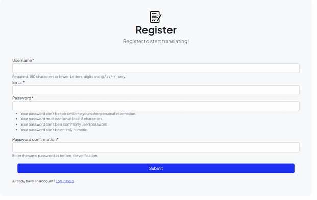
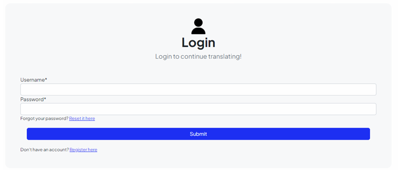
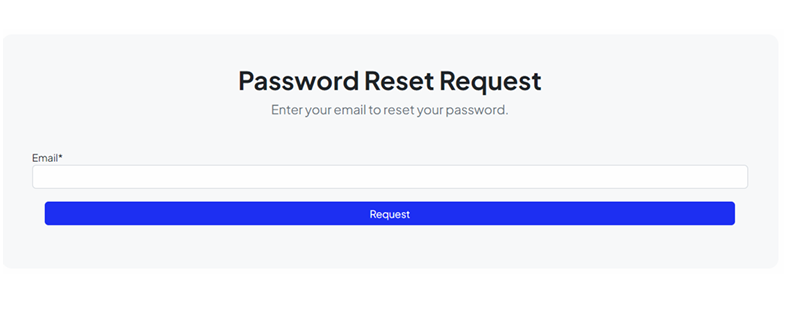
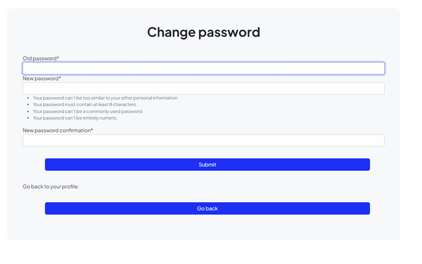
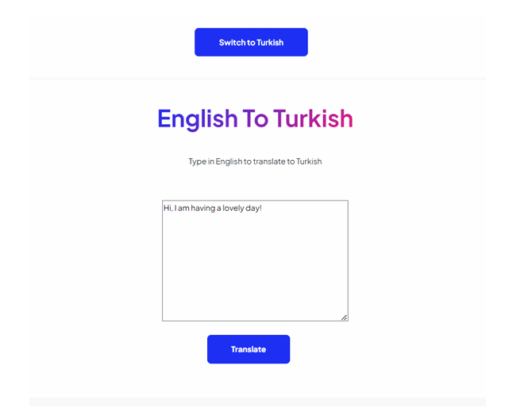
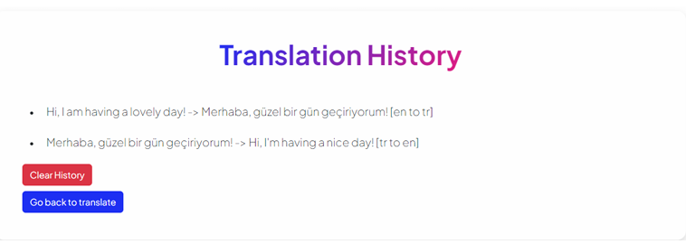

# Machine Translation Application
A machine‑translation web application built with Django, designed to provide translation functionality through a user‑friendly interface.

<p align="center">
  
  
  
  
  
  
  
  
</p>


## Table of Contents  
- [About](#about)  
- [Features](#features)  
- [Tech Stack](#tech‑stack)  
- [Getting Started](#getting‑started)  
  - [Prerequisites](#prerequisites)  
  - [Installation](#installation)  
  - [Running Locally](#running‑locally)  
- [Models Used](#models‑used)  
- [Configuration](#configuration)  
- [Usage](#usage)  

## About  
This project implements a web‑based machine translation application. The front‑end uses HTML, CSS, and JavaScript, and the back‑end is developed with the Django framework (Python).  
The aim is to allow users to input text in one language and obtain translations in another language via a clean, user‑friendly interface.

## Features
- Create a new account  
- Log in to an existing account  
- Reset a forgotten password  
- Update or change your profile information  
- Translate text from English → Turkish and Turkish → English  
- Access your translation history  
- Delete translation history  
- Log out of your account  

## Tech Stack  
- **Backend**: Django (Python)  
- **Frontend**: HTML5, CSS3, JavaScript  
- **Dependencies**: Listed in `requirements.txt`  
- **Deployment**: Ready for platforms like Heroku via `Procfile.txt`  

## Getting Started  

### Prerequisites  
- Python 3.x  
- pip (Python package installer)  
- A virtual environment tool (recommended)  

### Installation  
1. Clone the repository:  
```bash
git clone https://github.com/kartalceren1/mtapplication.git
cd mtapplication
```

2. Create and activate a virtual environment:  
```bash
python3 -m venv venv
source venv/bin/activate   # On Windows: venv\Scripts\activate
```

3. Install the Python dependencies:  
```bash
pip install -r requirements.txt
```

### Running Locally

1. Apply migrations:  
```bash
python manage.py migrate
```

2. Create a superuser (optional, for admin access):  
```bash
python manage.py createsuperuser
```

3. Start the development server:  
```bash
python manage.py runserver
```

4. Open your browser and visit `http://127.0.0.1:8000/` to view the application.

### Models Used
This application uses the following translation models:

- ckartal/english-to-turkish-finetuned-model — a fine‑tuned version of a MarianMT model for English → Turkish translation. (https://huggingface.co/ckartal/english-to-turkish-finetuned-model)

Based on the Helsinki‑NLP opus‑tatoeba‑en‑tr dataset (Tatoeba) for training.

Achieved BLEU score of about 51.2 after fine‑tuning.

- ckartal/turkish-to-english-finetuned-model — a fine‑tuned version of a MarianMT model for Turkish → English translation. (https://huggingface.co/ckartal/turkish-to-english-finetuned-model)

Based on the Helsinki‑NLP opus-mt-tr-en dataset (Tatoeba) for training.

Achieved BLEU score of about 64.5 after fine‑tuning.

### Usage

Sign Up / Log In: Create a new account or log in to an existing one.

Profile Management: Update your profile information or reset your password if needed.

Translation: Enter text in English or Turkish and get translations in the other language.

Translation History: View your past translations and delete history entries if desired.

Log Out: Safely log out of your account when finished.
